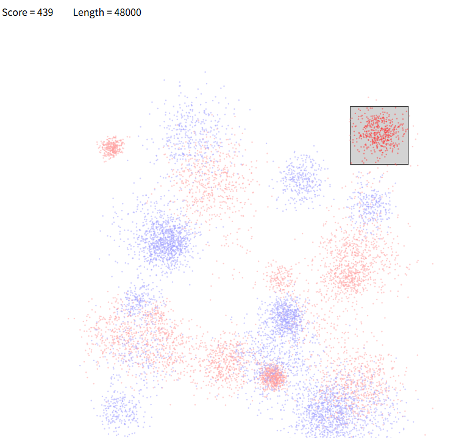
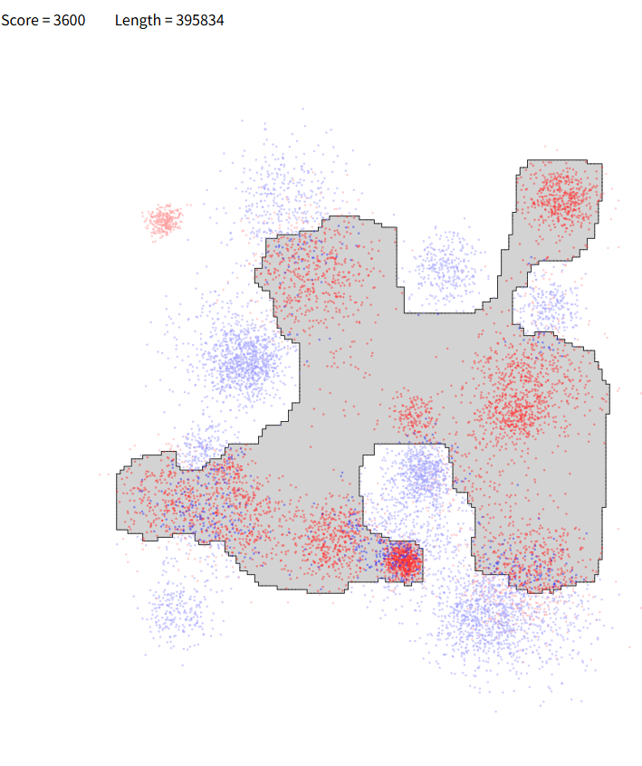

# 赛题名称
## Purse Seine Fishing
# 赛题描述
## 给定一个二维网格地图，里面有两种鱼的坐标，使用多边形包围网格中的某块区域
# 得分函数
## 计算网格中鱼A和鱼B的数量，最大化鱼A-鱼B的数量
# max(0, a - b + 1)
# 样例展示(我的解）

# 样例展示(优质解）

# 解题思路（myself)
## 利用kmean聚类，再遍历所有聚类的区域选择得分的最高区域即可
# 高质量解题思路（top5)
## 待补充

