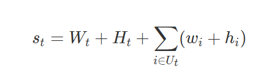
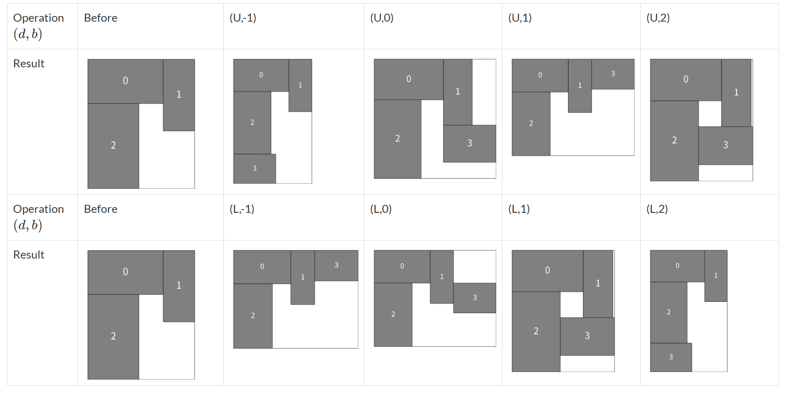

# 赛题名称
## Packing Uncertain Rectangles
# 赛题描述
## 类似于俄罗斯方块游戏，区别在与这里给定已知数量不同长宽的矩形，放置在长宽都不固定的布局中，使得最终形成布局的长宽之和最小。
# 得分函数
## 使得最后一个完成任务的截至时间最小。

# 样例展示

# 解题思路
## 这是典型的组合优化问题中车间调度问题，属于NP-hard问题。这类问题可以通过生成较高质量的初始解以及启发式搜索来得到比较好的结果。具体的，以AOE工程网络为原型，整个工程完成的时间取决与关键路径的长度，在这题中就对应了最小化最后一个完成任务的时间，先以将个拓扑结构从后往前走一遍，计算出每个任务完成的倒序时间点（理论上最快完成的时间点），然后设计评分函数（围绕得到的倒序时间点和该任务的后续依赖任务的数量），得到初始解。然后再用爬山算法进行迭代，具体的每次选择k个任务，将这k个任务重新选择磁盘和机器，然后由于我得到的初始解已经确定了任务的调度顺序，所以重新选择后只需要重新计算任务可以调度的开始时间即可，最后使得在时间限制之内得到最好结果。

