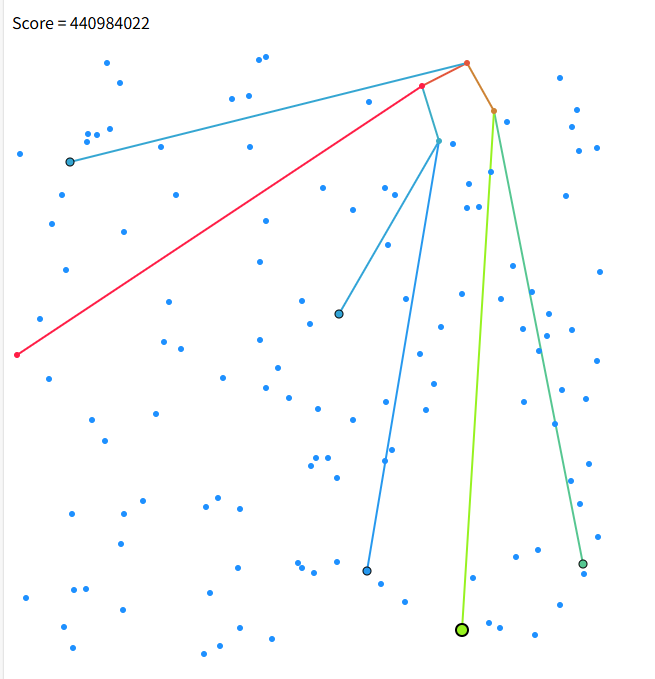
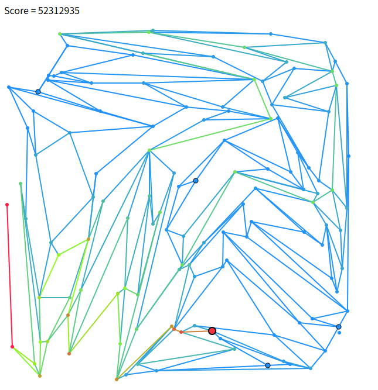

# rank(289)
# 赛题名称
## [概率垃圾分类](https://atcoder.jp/contests/ahc051)
# 赛题描述
## 通过有效组合多个分拣机，尽可能准确地进行垃圾分类。
# 得分函数
## 得分细节如下图所示(N表示垃圾的数量，q表示垃圾被处理的概率， 当概率越大，得分越高（这里的评分函数数值越低））

# 样例展示(我的解）

# 样例展示(优质解）

# 解题思路（myself)
## 待补充
# 高质量解题思路（top5)
## 待补充

