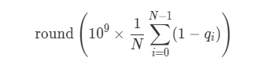

# 赛题名称
## Probabilistic Waste Sorting
# 赛题描述
## 通过有效组合多个分拣机，尽可能准确地进行垃圾分类。
# 得分函数
## 得分细节如下图所示(N表示垃圾的数量，q表示垃圾被处理的概率， 当概率越大，得分越高）

# 样例展示

# 解题思路（myself)
## 初始解：考虑一种最理想化的情况，所有的矩阵的长宽一致,那么事实上只要做到布局的长宽越接近越好，比如我有25个正方形，那么5×5放置得到结果一定是最优，基于这个假设，我可以求出理论最好的上界和下界的边长。按行贪婪的放置矩阵，累加当前行的长度，当行长度大于理论上界，则换行。放完所有矩阵后提交，通过系统反馈的布局长宽来调节理论上界，最后得到比较接近的长宽布局。
## 优化：按照上述初始解放置后，在测试样本分布均匀的时候效果较好，在分布不均匀的时候，效果较差，会出现空白，导致占有率下降。这里注意到测试样例中的长宽并不是实际的长宽（有测量误差），所以我牺牲一定的提交次数来调整实际的长宽，然后在每个选择最好的初始解重置，现在在放置的时候考虑后续的影响效果，具体做法是放置当前矩阵的时候设计领域空间（就是对矩阵的翻转和'U'、'L'，以及依靠位置进行排列组合），设置影响因子（就是在该矩阵放置后，后面的矩阵也依次放入，为了不超时，并且达到最好效果，选择适中长度的链长即可，在计算链中矩阵放置的时候，只需要按照上述领域空间进行放置就行，不考虑后续影响）。
# 高质量解题思路（top5)
## 待补充

