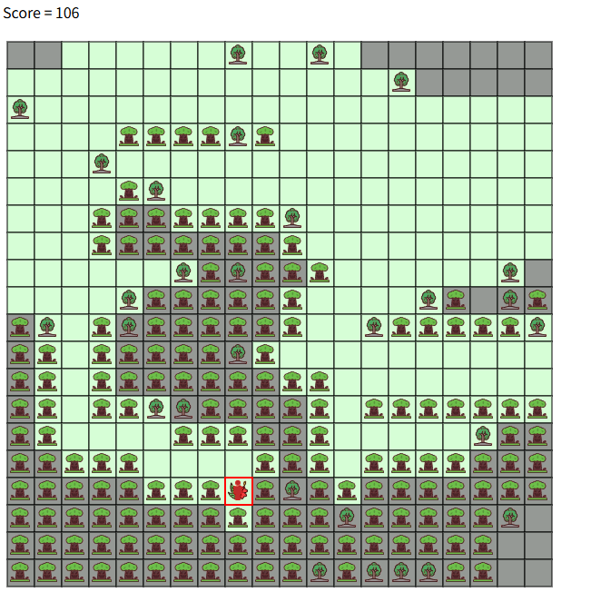
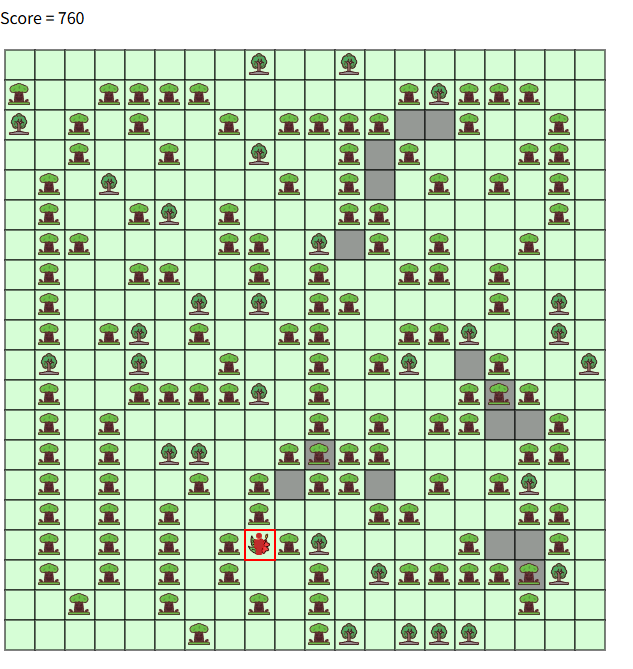

# rank(800)
# 赛题名称
## Treant's Forest 
# 赛题描述
## 设计迷宫，使得冒险者到达终点（花朵位置）所要走的次数最大化
# 得分函数
## 最大化到达花朵的步数

# 样例展示(我的解）

# 样例展示(优质解）

# 解题思路（myself)
纯随机构造迷宫（前提：不能堵死到花朵的路径）
## 不足：很明显要有较好的效果，需要设计迷宫地图
# 高质量解题思路（top5)
## 待补充

