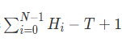
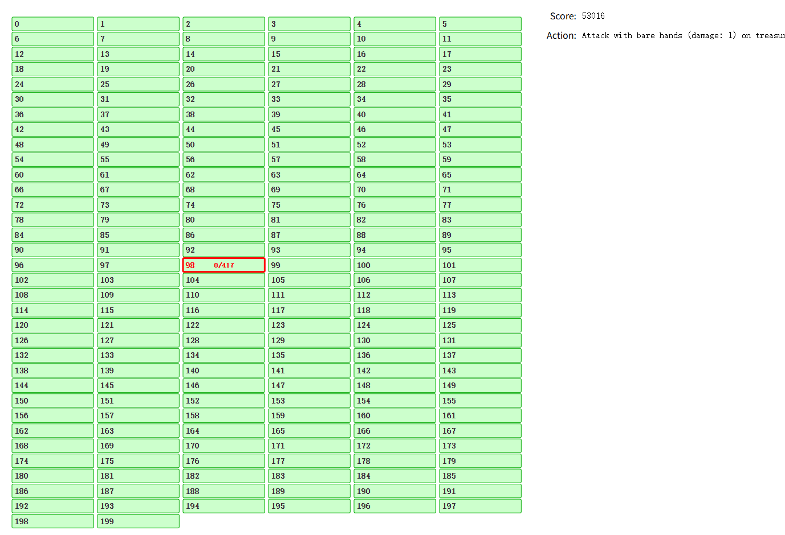
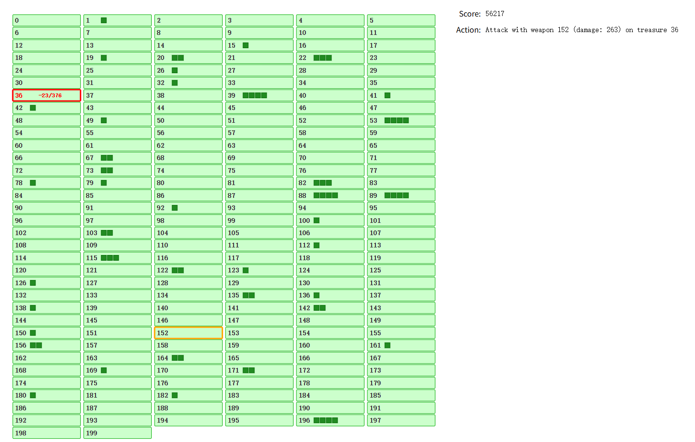

# rank(249)
# 赛题名称
## Weakpoint
# 赛题描述
## 用最少的攻击次数打开所有箱子，打开箱子可以拿到武器，攻击的选择方式有手或者已有的武器
# 得分函数
## 用最少的攻击次数打开所有箱子

# 样例展示(我的解）

# 样例展示(优质解）

# 解题思路（myself)
## 秉持原则：有武器用武器，没武器再用手; 
### 1.没有武器：设计估分函数来评估用手打开的最优选择;
```
auto get_box_priority = [&](int box) {
    if (rem_hard[box] <= 0) return -1.0;
    return (C[box] * max_attack[box] * 1.0) / rem_hard[box];
};
```
### 2.有武器： 组合武器和箱子，设计估分函数来选择最优的组合;
```
auto find_best_weapon_attack = [&](int pA, double pB) -> pair<int, int> {
    int best_w = -1, best_b = -1;
    double best_efficiency = -1;
    // 遍历所有可用武器
    for (int w = 0; w < N; ++ w) {
        if (!opened[w] || rem_dur[w] <= 0) continue;
        
        // 遍历所有未开启的宝箱
        for (int b = 0; b < N; ++ b) {
            if (opened[b]) continue;
            int damage = min(A[w][b], rem_hard[b]);
            if (damage <= 1) continue; // 只有伤害大于1才考虑使用武器
            double efficiency = damage * 1.0;
            if (damage >= rem_hard[b]) {
                efficiency += pA;
            }
            int up = max(1, int( 0.8 *  total_rem_hard / (200 - opened_cnt)));
            if (A[w][b] == max_vaild[b]) efficiency += min(averageAttack, up);
            if (A[w][b] == max_attack[w]) efficiency += min(averageAttack, up);
            // 考虑武器耐久度的价值
            efficiency *= 1.0 * rem_dur[w] / pow(1.0 * C[w], pB);
            if (efficiency > best_efficiency) {
                best_efficiency = efficiency;
                best_w = w;
                best_b = b;
            }
        }
    }
    
    return {best_w, best_b};
};
```
## 不足：只考虑当前最优，没有考虑全局选择，我选择的武器基本贡献一个箱子，但在数学证明后发现一个武器在贡献多个箱子的时候会有更好的表现;
## 提高：在组合武器和箱子的时候，在估分函数中需要加入当前武器对其他未打开箱子的影响;
# 高质量解题思路（top5)
## 待补充

