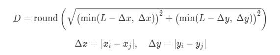

# rank(463)
# 赛题名称
## Molecules
# 赛题描述
## 在一张二维环状网格地图中有300个点，由于300个点都有一个速度，所以每个时刻300个点的位置是一直在变化的，要求将300个点分成10个连通块，每个连通块平均分30个点
# 得分函数
## 使得分完所有连通块后的连接成本越低越好

## 位置更新

# 样例展示(我的解）

# 样例展示(优质解）

# 解题思路（myself)
## 主体的思路是先搜出顺序目标点的所有路径，依次遍历路径上的所有点，模拟每个点走的情况，用颜色+状态同步记录更新，隔一个点复用一个颜色和状态，直到走完所有点
## 提高：复用颜色和状态还不够多，并且给的条件步数有足够的冗余未能够利用，可以复用更多的颜色+状态，可能需要重新规划路径来设计
# 高质量解题思路（top5)
## 待补充

