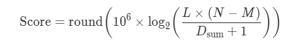
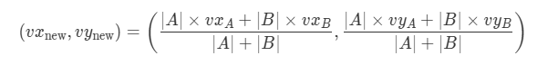
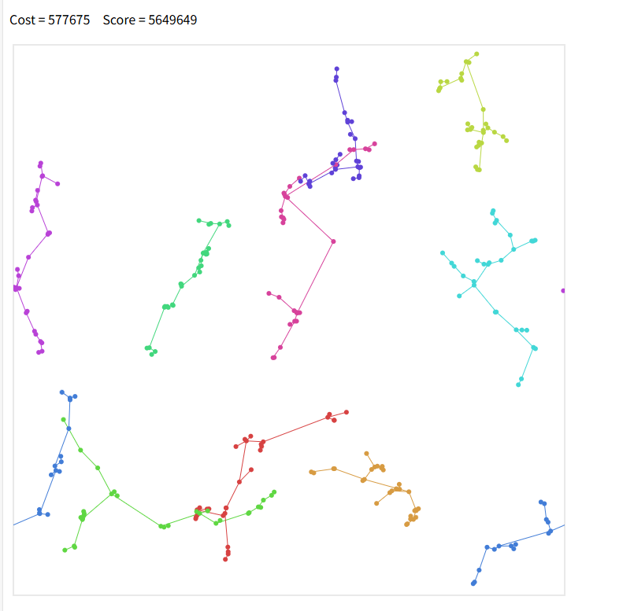

# rank(463)
# 赛题名称
## [Molecules](https://atcoder.jp/contests/ahc057)
# 赛题描述
## 在一张二维环状网格地图中有300个点，由于300个点都有一个速度，所以每个时刻300个点的位置是一直在变化的，要求将300个点分成10个连通块，每个连通块平均分30个点
# 得分函数
## 使得分完所有连通块后的连接成本越低越好

## 速度更新与位置更新

# 样例展示(我的解）

# 样例展示(优质解）

# 解题思路（myself)
## 遍历所有时刻，对每个时刻做以下计算，先划分网格2x5天然分成10个簇，对10个簇内的30个点利用MST计算出最小成本进行连接，这样可以找出最好的连接时刻;再利用启发算法搜下提高解质量
## 不足：完全没有考虑不同时刻连接部分点的做法，导致解质量很差（需要把点位置、速度、合并后速度改变这几个条件好好利用）
# 高质量解题思路（top5)
### tip:在[top.cpp]()中的代码是与正赛第一名代码保持高度一致，如有侵权请联系 : [2389287408@qq.com]()

