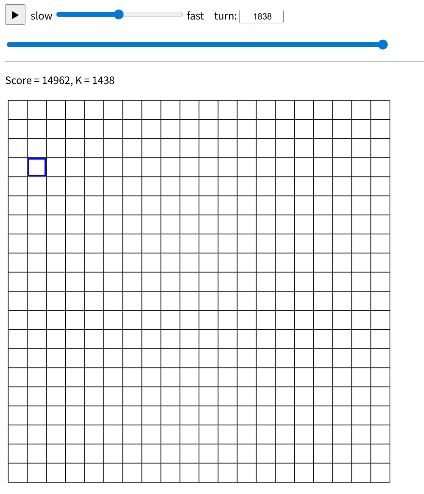
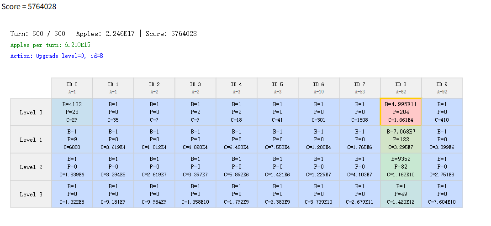

# rank(113)
# 赛题名称
## [Apple Incremental Game](https://atcoder.jp/contests/ahc058/tasks/ahc058_a)
# 赛题描述
## 由10种不同类型的机器，并且每种机器有不同的等级层次，上层的机器负责生产下层的机器，最下层的机器负责生产苹果，机器有对应的数量和功率，需要花费苹果来提升功率，提升后机器的生产效率变高，同时下次提升的成本也变大
# 得分函数
## 在规定步数之后生产的苹果越多越好

# 样例展示(我的解）

# 样例展示(优质解）

# 解题思路（myself)
## 这次赛题我的解体思路和赛事前排思路差不多，构造好基础解后，高效启发后得到优质解，并且测试多组测试数据集后发现，我的结果和优质解的结果都有一个共同的特点，就是对机器的升级（提高效率）一定是集中在某种类型上，所以我认为这里可以约束启发的方向
# 高质量解题思路（top5)

