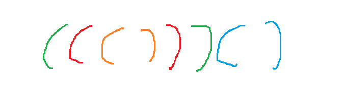

# rank(197)
# 赛题名称
## [Stack to Match Pairs](https://atcoder.jp/contests/ahc059/tasks/ahc059_a)
# 赛题描述
## 这是一个关于在N×N网格上进行的卡片消除游戏问题，其中N=20。玩家需要移动、拾取和放置卡片，使得所有卡片最终从网格和牌堆中移除。评分取决于移动次数和剩余卡片数。为了最大化分数，需要确保所有卡片都被消除（X=0），并最小化移动次数K
# 得分函数
## 在保证消除所有卡牌的前提下，最小化移动次数

# 样例展示(我的解）

# 样例展示(优质解）

# 解题思路（myself)
## 本赛是一个经典的贪心+启发的优化题，可以作为优化赛题的模板题，首先先抽象出问题本质，就是成对括号消除问题。再根据贪心的构造一些合法解，比如成对消除序列或者树结构序列等方式来解决。我采用的是成对消除序列的方法，有一个很大的弊端就是解的质量特别差，导致后面的启发后的结果不如树结构序列的贪心效果好。
# 高质量解题思路（top5)
## 采用了树结构序列，贪心解完全接近最优解，启发后能达到很好的效果。

# 成对消除序列

# 树结构序列

## 从上述两幅图能够看到，树结构序列搜索解的空间更加庞大，完全囊括了我用的贪心解所在子空间

### tip:在top.cpp中的代码是与正赛第一名代码保持高度一致，如有侵权请联系 : 2389287408@qq.com
