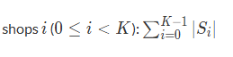
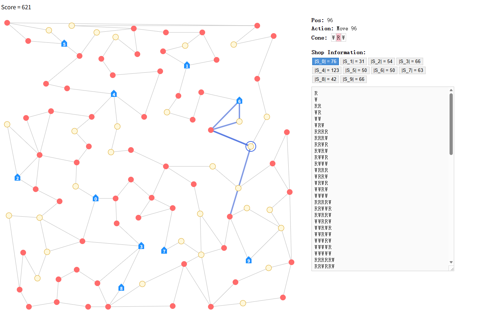
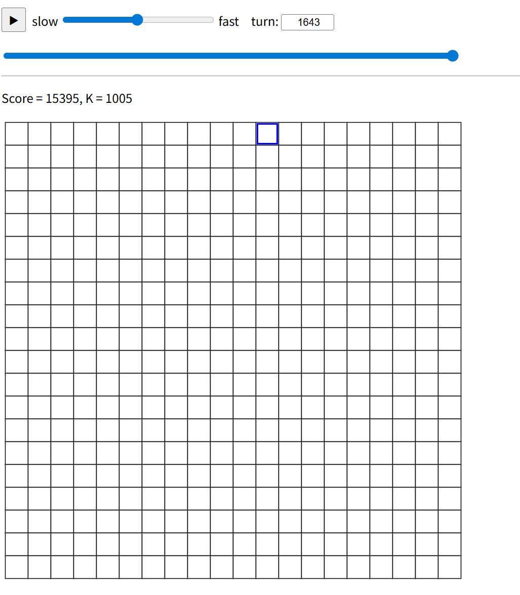

# rank(405)
# 赛题名称
## [Ice Cream Collection](https://atcoder.jp/contests/ahc060/tasks/ahc060_a)
# 赛题描述
## 在这个问题中，你扮演一个冰淇淋制作者，在一个由顶点和边组成的连通无向图中移动。图中有两种顶点：冰淇淋商店（顶点0到K-1）：用于交付冰淇淋字符串，每个商店有一个库存集合，包含不同的字符串。冰淇淋树（顶点K到N-1）：提供冰淇淋口味，初始均为香草口味（W），但可以通过行动2变为草莓口味（R）。你从顶点0（一个商店）开始，手持一个空蛋筒（字符串）。允许的行动包括：行动1：移动到相邻顶点。如果顶点是树，则收获当前口味（W或R）并添加到蛋筒字符串末尾；如果顶点是商店，则将当前蛋筒字符串添加到该商店的库存集合，然后清空蛋筒。移动时不能直接返回上一个行动1的起始顶点。行动2：仅在当前位置是香草树（W）时，将其变为草莓树（R）。
# 得分函数
## 在规定的步数之内，使得所有商店的不同冰淇淋字符串总数越多越好

# 样例展示(我的解-version1）

# 样例展示(我的解-version2）

# 解题思路
## 本赛题中正式赛中是上面的version1中的方案，通过随机游走结合轮询商店来得分，但是这样有许多弊端，第一个弊端就是无效游走，第二个弊端就是轮询商店可能路途走的太远，第三就是可能该商店已经拥有该字符串了，仍然送到该商店就是一次无效操作。所以在赛后我结合正赛第一名思路又写了version2方案，其实改动就是删去了随机游走，并且每次从上次达到的商店寻找可以达到最近的商店并且该商店未拥有当前制作的冰淇淋（字符串）就选择该商店过去，路径选择就用bfs走最短路搜到第一条符合上述要求就行，到达该商店后，以该商店为起点，重复上述过程知道规定步骤达到上限。需要注意的就是限制下bfs深度。至于翻转的话有两种方式，第一种在模拟过程中以一定概率翻转，第二种就是在初始化所有点翻转的时刻，在模拟到该时刻并且走到该点的时候就翻转就行了。启发上来说由于翻转是随机设置的，那么可以多次重启贪心就能达到不错的效果。

